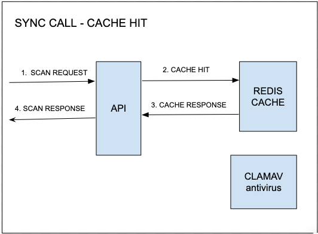
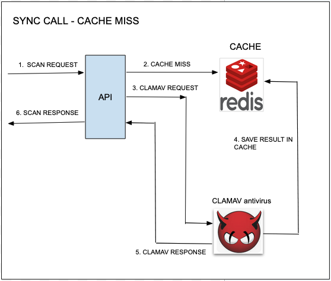
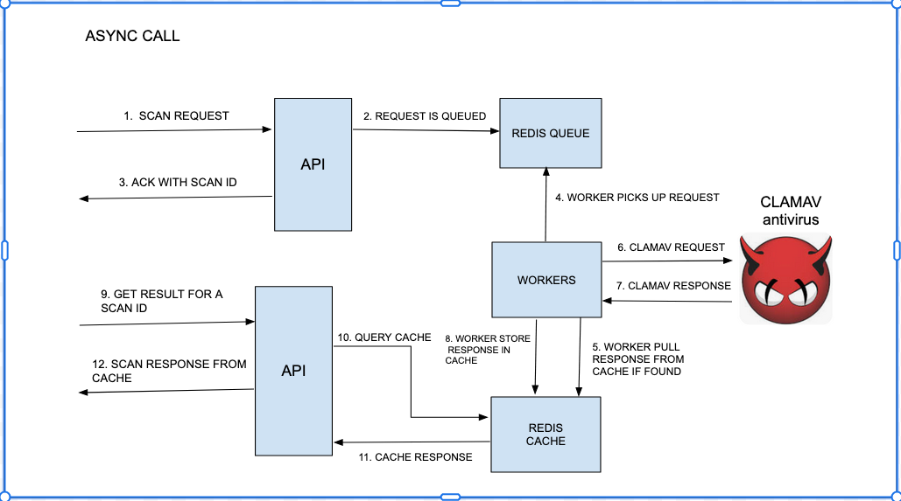

# Virus-scan-at-scale
Current project implemented in java language, a system that scans files for virus detection.
This system design is meant to handle thousands of files in parallel for virus scan.

We worked on two approaches:
1. Synchronous scan.
2. Asynchronous scan.

## 1. Synchronous scan:

On this approach, the external user sends the scan request and waits for the result.
It makes use of a caching layer to memorize the result of a scan request. 
In this way, we avoid scanning the same file content twice. Take into account that file
scanning for virus is an expensive operation.  

We have two different call flows, depending on whether we have a cache hit or miss.

For a cache HIT, we have the following call flow:

1. SCAN REQUEST: external user sends the scan request which is received by the API.
2. CACHE HIT: the scan id contained in the scan request was found in the redis cache. 
3. CACHE RESPONSE: the redis cache provides the result of the scanning without an actual virus scan.
4. SCAN RESPONSE: external user received the scan response containing the virus scan results of the file sent.

And for the cache MISS, the flow is as follows:

1. SCAN REQUEST: external user sends the scan request which is received by the API.
2. CACHE MISS: the scan id sent by the external user was NOT found in the redis cache.
3. CLAMAV REQUEST: the logic in the backend sends a CLAMAV request against the CLAMAV antivirus.
4. SAVE IN REDIS CACHE: CLAMAV provides the result of virus scanning and save it in REDIS cache.
5. CLAMAV RESPONSE: the CLAMAV response is provided to the API backend.
6. SCAN RESPONSE: CLAMAV RESPONSE is parsed and an scan response is sent to the external user.

## 2. Asynchronous scan:
   On this approach, the external user sends the scan request and does not wait for the response.
   Instead, it queries for the result at a later time.
   The scan request contains the file that the user wants to scan for virus.
   This is the call flow:

1. SCAN REQUEST: external user sends the scan request which is received by the API.
2. REQUEST QUEUED: SCAN request is sent to redis queue without any processing of such request.
3. ACK WITH SCAN ID: the backend sent a response to the external customer with a scan ID. 
   That id is used later to retrieve a scan result.
4. WORKER PICKS UP REQUEST: a thread is listening on the redis queue. As soon as a request is added to the queue, it is picked up
   by a worker for processing.
5. WORKER PULLS RESPONSE FROM CACHE: the worker extracts the scan id from the scan request and verify if scan id is a present key
                                     in the redis cache.
6. CLAMAV REQUEST: if scan id is not found in the redis cache, the scan request is sent to the clamav antivirus.
7. CLAMAV RESPONSE: worker received the scan response from clamav. 
8. WORKER SAVES RESPONSE IN CACHE: worker parsed the clamav response and stores it on redis cache as a scan response.
9. GET RESULT FOR A SCAN ID: external user polls for the scan result using the scan ID in the original scan request.
10. QUERY CACHE: the logic in the backend received the request, extracts the scan ID and check if that id is an existing key
                 in redis cache. 
11. CACHE RESPONSE: if scan ID is present in the redis cache as a key, the respective value contains the scan result. That scan
                    result is extracted by the logic of the backend.
12. SCAN RESPONSE FROM CACHE: the scan result is parsed and sent to the external user. 
                                    
 

